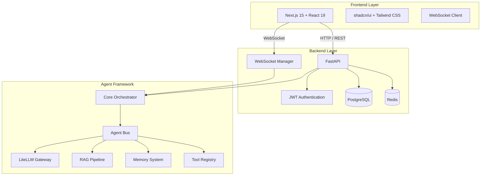

# ChatAgent

ChatAgent 是一个集成了实时聊天和 AI Agent 的协作平台。它结合了现代即时通讯的实时性与大型语言模型（LLM）驱动的智能 Agent 能力，为用户提供智能化的对话体验和自动化任务执行能力。

## 目录结构

```
alonechat-all/
├── chat-app/
│   ├── backend/          # FastAPI 后端服务
│   │   ├── main.py
│   │   ├── auth.py
│   │   ├── models.py
│   │   ├── schemas.py
│   │   ├── database.py
│   │   ├── websocket_manager.py
│   │   ├── config.py
│   │   ├── alembic/
│   │   ├── requirements.txt
│   │   └── venv/
│   └── frontend/         # Next.js 前端应用
│       ├── src/
│       │   ├── app/
│       │   ├── components/
│       │   └── lib/
│       ├── package.json
│       └── .next/
├── agent-framework/      # AI Agent 框架
│   ├── agent_framework/
│   │   ├── agent/
│   │   ├── core/
│   │   ├── llm/
│   │   ├── memory/
│   │   ├── rag/
│   │   ├── tools/
│   │   └── security/
│   ├── tests/
│   └── pyproject.toml
├── ChatAgent.code-workspace
├── Makefile
├── .gitignore
└── README.md
```

## 环境要求

- **Python**: 3.11+
- **Node.js**: 18+
- **PostgreSQL**: 16+
- **Redis**: 7+

## 快速开始

### 1. 克隆仓库

```bash
git clone <repository-url>
cd alonechat-all
```

### 2. 创建 Python 虚拟环境

```bash
# 后端虚拟环境
cd chat-app/backend
python -m venv venv
source venv/bin/activate  # Linux/macOS
# 或
. venv/Scripts/activate   # Windows

# Agent 框架虚拟环境
cd ../../agent-framework
python -m venv .venv
source .venv/bin/activate  # Linux/macOS
# 或
. .venv/Scripts/activate   # Windows
```

### 3. 安装依赖

```bash
# 在项目根目录执行
cd ../..
make install
```

### 4. 配置环境变量

```bash
# 复制后端环境变量模板
cp chat-app/backend/.env.example chat-app/backend/.env

# 编辑 .env 文件，配置数据库连接、Redis、JWT 密钥等
```

### 5. 初始化数据库

```bash
make db-init
```

### 6. 启动开发服务器

```bash
# 同时启动后端和前端
make dev

# 或分别启动
make dev-backend   # 启动 FastAPI 服务 (http://localhost:8000)
make dev-frontend  # 启动 Next.js 服务 (http://localhost:3000)
```

## Makefile 命令速查表

| 命令 | 说明 |
|------|------|
| `make install` | 安装所有依赖（并行执行 pip + npm） |
| `make dev` | 同时启动后端 uvicorn + 前端 Next.js dev |
| `make dev-backend` | 仅启动后端开发服务器 |
| `make dev-frontend` | 仅启动前端开发服务器 |
| `make test` | 同时运行 pytest + npm test |
| `make test-backend` | 仅运行后端测试 |
| `make test-frontend` | 仅运行前端测试 |
| `make test-agent` | 仅运行 Agent 框架测试 |
| `make lint` | 同时运行 ruff check + npm run lint |
| `make lint-backend` | 仅运行后端代码检查 |
| `make lint-frontend` | 仅运行前端代码检查 |
| `make clean` | 清理 __pycache__、.next、node_modules、venv |
| `make db-init` | 初始化 PostgreSQL 数据库 |
| `make help` | 列出所有可用命令 |

## 项目架构



## 技术栈

### 后端
- **FastAPI**: 高性能异步 Web 框架
- **SQLAlchemy 2.0**: ORM 与数据库交互
- **Alembic**: 数据库迁移管理
- **Redis**: 缓存与消息队列
- **WebSockets**: 实时通讯
- **JWT**: 身份认证

### 前端
- **Next.js 15**: React 全栈框架
- **React 19**: UI 库
- **Tailwind CSS 4**: 原子化 CSS
- **shadcn/ui**: 组件库
- **Radix UI**: 无头组件基座

### Agent 框架
- **LiteLLM**: 多模型 LLM 网关
- **ChromaDB**: 向量数据库
- **NetworkX**: DAG 编排
- **Tenacity**: 重试与容错

## 许可证

MIT License
